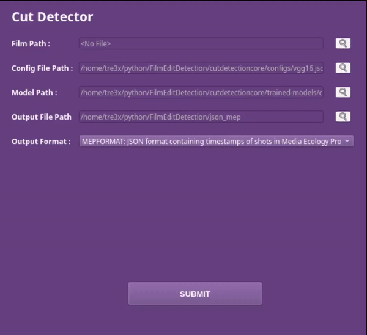

# FilmEditDetection
 

## About

This is a GUI tool to detect cuts in films, especially old films with noisy and broken frames. This tool basically takes an input video and stores cuts in various formats - frame index of cuts alongwith type of cut in CSV format, timestamp in seconds of start and end shots in the film, MEP json format containing shots timestamps, and a format which is supported by cinemetrics for further analysis. 
This tool was produced for Google Summer Code 2021-2022 with RedHenLabs and Media Ecology Project. 

## Getting Started

### Prerequisites
You need Python 3.x and Conda package manager to run this tool

### Installation
For installing this tool with pretrained model, follow the steps below :
1. Clone this repository `git clone https://github.com/tre3x/FilmEditDetection.git`
2. Switch to `master` branch `git checkout cmaster`
3. Install the neccessary dependencies by executing `conda env create -f environment.yml`

### Pre-Trained Model
One pre-trained model of specific configuration is available, which can be found [here](https://drive.google.com/file/d/1KdyW31aCh6iD1Ot0RJK-N14-4A4NHNiD/view?usp=sharing).

## Usage

To launch the GUI version of the tool, follow the steps in the **Installation** section.
After setting up the environment, Run `python cutdetectorui.py`

##  Future Works
- The wool window freezes while there is an ongoing computation. This can be fixed by running the interface and the background process at different threads.
- Implementation of progress bar of the process in the interface.